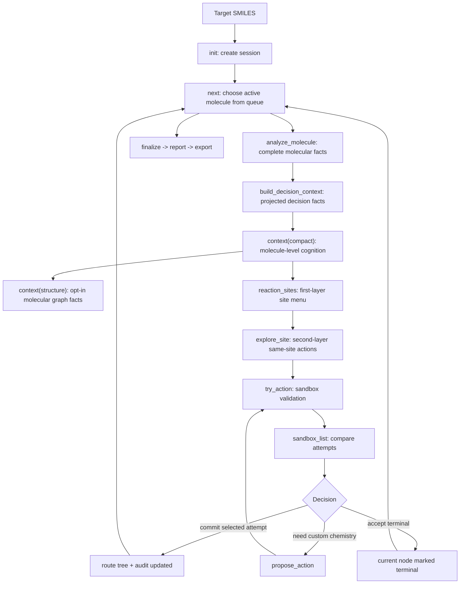

# Rachel-v2 Workflow

This document is the operational workflow for the current Rachel-v2 skill.
It replaces the old v1 workflow that used `explore`, `try_bond`,
`explore_fgi`, and `try_fgi` as the normal LLM path.

For ordinary route planning, start from `SKILL.md`; this file is the protocol
detail, maintenance, and debugging reference.

Rachel-v2 is a persistent retrosynthesis planning system with a strict role
boundary. Rachel supplies chemical facts, search-space scaffolds, evidence
classification, and durable audit state. The LLM or chemist owns route design,
reaction choice, precursor completion, evidence reconciliation, and the final
decision. Every tree edit still passes through structured state, action
disclosure, sandbox validation, and explicit commit audit.

Scope:
- Target project: the active Rachel-v2 workspace or installed Codex Skill.
- Runtime package: `Rachel/`.
- Recommended interpreter: Python from the active `rachel-v2` environment.
- Historical source workspaces are not part of this workflow.

## 1. Core Contract

The operating philosophy is:

```text
Rachel informs; the LLM decides.
Chemistry quality is the objective.
Hypothesize boldly; validate and audit strictly.
```

This means:

- templates, Smart CAP, reaction families, CS, and confidence are references;
- an LLM-designed action is a normal first-class candidate when it is a better
  chemical strategy and is written as one complete real event;
- gates classify contradictions, proof obligations, warnings, and tool limits;
  they do not select the chemistry;
- true chemical contradictions and validator/system failures stop commit;
  proof obligations should trigger more reasoning, evidence, or precursor
  repair rather than passive rejection;
- route depth is useful only when each additional step improves chemical
  explanation, precursor quality, convergence, or executability.

The canonical route-building loop is:

```text
init
-> next / context(compact)
-> reaction_sites()
-> explore_site(site_id)
-> choose one next real event:
   - listed action -> try_action(action_id)
   - complete one-step LLM action -> propose_action -> try_action
   - route-level or multi-event idea -> route_sketch -> one listed/custom action -> try_action
-> sandbox_list
-> commit or accept
-> next
-> finalize
-> report
-> export
```

The LLM should not start from hidden legacy bond/FGI commands during normal
planning. Those commands remain callable for compatibility and diagnostics, but
they are not the workflow.

The most important rule is:

```text
No route-tree change happens until commit or accept.
```

`try_action` only tests an action in the sandbox. It does not change the
route tree. `propose_action` only registers an LLM-proposed precursor set as
an action. It does not validate the chemistry. The proposed action must
still go through `try_action(custom_id)`.

## 2. System Model

Rachel-v2 keeps a JSON session as the durable state carrier. Each command reads
state, writes a structured result, and updates the session when needed.
The system records and checks the decision process; it does not replace the
chemist who decides what reaction should be attempted.



### State Objects

The session stores:
- target metadata and route tree
- queue of pending molecules
- current active molecule
- projected `decision_context` for the current molecule
- current sandbox attempts
- archived sandbox attempts after clear or commit
- committed decision audit
- custom actions registered for the active molecule

The LLM should read the smallest payload that supports the next decision. Do not
load diagnostic or full state unless debugging.

## 3. Layered Chemical Information Disclosure

Rachel-v2 separates fact generation from LLM-facing disclosure.

### Layer 0A: Molecular Fact Source

Internal function:

```python
analyze_molecule(smiles)
```

This is the complete static molecular record. It provides descriptors, indexed
atoms and bonds, ring members, stereo, symmetry, and scaffold topology. It is
not the default LLM prompt and its contents are observations, not a route
verdict.

### Layer 0B: Decision Context

Internal function:

```python
build_decision_context(smiles)
```

This function deliberately projects the molecular record into the decision
facts required by the route workflow. It includes:
- compact molecule summary
- functional groups
- complexity
- disconnectable bonds
- FGI options
- warnings
- custom actions when registered

It does not retain the complete atom/bond/ring/stereo record. This projected
layer feeds builders for compact context, site menus, action expansion, and
diagnostic views.

### Layer 1: Compact Cognition

Command:

```python
cmd.execute("context", {"detail": "compact"})
```

or the implicit compact returned by:

```python
cmd.execute("next", {})
```

Purpose:
- give the LLM a molecule-level overview
- identify whether the molecule deserves route work or terminal acceptance
- show the existence of reaction opportunities without embedding the whole
  first-layer menu
- mount short command policy and experience cards

Default compact should contain:
- current molecule status
- `molecule_brief`
- `functional_group_brief`
- `complexity_brief`
- `warnings`
- `reaction_opportunity_brief`
- `commands`
- `hint`
- `prompt_brief`

Default compact should not contain:
- full `site_reaction_map`
- full `reaction_menu`
- `bond_summary`
- `fgi_summary`
- `reaction_families`
- `strategy_groups`
- diagnostic/internal indices

### Opt-In Structure Detail

Command:

```python
cmd.execute("context", {"detail": "structure"})
```

This read-only view re-runs the shared molecular fact source for the active
SMILES and returns it under `current.molecule_structure`. Use it only when ring
members, stereocenter locations, whole-molecule topology, or indexed atom/bond
facts materially affect the next decision. It is not persisted into the
session, synthesis tree, or compact context, and it is not a required route
stage.

The key compact field is `reaction_opportunity_brief`:

```json
{
  "site_count": 0,
  "total_reaction_count": 0,
  "action_count": 0,
  "competing_site_count": 0,
  "high_competition_sites": [],
  "reaction_names": [],
  "first_layer_command": "reaction_sites()"
}
```

LLM use:
- Form a top-level route hypothesis.
- Notice high-competition sites.
- Decide whether to call `reaction_sites()` or accept terminal.
- Do not choose an action from compact alone.

### Layer 2: First-Layer Site Menu

Command:

```python
cmd.execute("reaction_sites", {})
```

Purpose:
- expose the complete first decision layer
- group actions by real reaction site rather than by hand-written strategy
  groups
- let the LLM choose a concrete site for deeper comparison

The primary payload is `site_reaction_map`.

Each site should expose:
- `site_id`
- `site_type`
- `site_hint`
- `action_count`
- `reaction_count`
- `source_summary`
- `risk_hint`
- `reactions`
- `next_step`
- `competition_hint` when multiple reactions compete at the same site

Each reaction row inside a site should expose:
- `reaction_id`
- `reaction_name`
- `action_count`
- `source_summary`
- `risk_hint`

LLM use:
- Choose the real site first.
- Prefer convergence, site fidelity, late handle installation, and functional
  group compatibility.
- If a site has same-site competition, expand that site before sandboxing.
- Do not sandbox directly from first-layer menu unless the action ID is
  already known from a prior expanded view.

### Layer 3: Second-Layer Same-Site Action Expansion

Command:

```python
cmd.execute("explore_site", {"site_id": "bond:10"})
```

Purpose:
- expand all actions competing at one real site
- let the LLM compare reaction mechanisms and precursor sets before sandboxing
- preserve enough original indices for audit and compatibility

Expected payload:
- `site_id`
- `site_type`
- `site_hint`
- `action_count`
- `reaction_count`
- `source_summary`
- `risk_tags`
- `risk_hint`
- `competition_hint` when present
- site-level bond/FGI metadata when available
- `reactions`
- `actions`
- `next_step`
- `prompt_brief`

Each action may include:
- `action_id`
- `reaction.id`
- `reaction.name`
- `source`
- `source_label`
- `template_id`
- `template_name`
- `precursors_preview`
- original `bond_idx`, `alt_idx`, `fgi_idx`, `smart_idx`
- `actual_bond_idx`
- `atoms`
- `role_pair`
- `bond_type`
- `in_ring`
- `heuristic_score`
- `confidence`
- custom action fields when applicable
- `risk_tags`

LLM use:
- Compare same-site actions before trying them.
- Focus on mechanism, site fidelity, precursor realism, atom accounting, and
  risk tags.
- Use `try_action(action_id)` for one or more actions.
- Treat listed and complete LLM-designed one-step actions as peer hypotheses.
  Use `propose_action(...)` for a different same-site reaction or an unlisted
  disconnection; if the custom action changes topology, also carry the explicit
  audit fields before sandboxing.

## 4. Action Model

Rachel-v2 normalizes different proposal sources into a stable `CandidateUnit`.

Action sources:
- `bond`: normal reaction-template disconnection action
- `fgi`: functional group interconversion action
- `smart_capping`: heuristic structural hint requiring LLM completion
- `custom_precursors`: LLM-proposed precursor set registered by
  `propose_action`
- `terminal`: terminal acceptance action, not a sandbox reaction

Action IDs are stable within the current decision context. Examples:

```text
bond:10:alt:0
fgi:2
smart:10:0
custom:late_snar_precursor:0
terminal:accept
```

`try_action(action_id)` is the only recommended sandbox entry point. It
dispatches internally to the correct legacy operation when needed.

## 5. Public Commands

The default LLM-facing public command set is:

```text
init
next
context
reaction_sites
explore_site
try_action
propose_action
sandbox_list
sandbox_clear
select
commit
accept
skip
tree
status
continuation_status
continuation_abort
finalize
report
export
smart_cap
custom_cap
```

### Hidden Legacy and Diagnostic Commands

These commands are intentionally hidden from default help and LLM prompts:

```text
explore
explore_reaction
explore_fgi
try_bond
try_fgi
try_precursors
```

They remain callable for compatibility, old scripts, and expert diagnostics.
They should not guide ordinary route decisions.

## 6. Command Semantics

### init

Create a session.

```python
cmd.execute("init", {
    "target": "CC(C)(C)[C@@H](CS(C)(=O)=O)Nc1nc(-c2c[nH]c3ncc(F)cc23)ncc1F",
    "name": "target_route",
    "max_depth": 15,
    "max_steps": 50,
    "terminal_cs_threshold": 2.25
})
```

### next

Select the next active molecule from the BFS queue and return compact context.
It may auto-accept trivial `quick_pass` nodes.
Low-CS molecules with assigned stereocenters are excluded from automatic
`quick_pass`; they enter the normal LLM loop so stereochemical origin and any
credible deeper rollback can be reviewed. Very small molecules and achiral
low-CS building blocks retain the existing automatic behavior.

Exception: if a pending multi-step strategy continuation points at a molecule
that would normally be quick-passed, `next` must surface it as a standard
review node. The LLM-facing payload then includes
`prompt_brief.strategy_continuation_brief`.

Use `next` after every successful `commit` or `accept`.

### context

Return context for the current active molecule.

Recommended:

```python
cmd.execute("context", {"detail": "compact"})
```

On-demand molecular structure facts:

```python
cmd.execute("context", {"detail": "structure"})
```

The structure record is returned at `current.molecule_structure` and is not
written into session state.

Diagnostic only:

```python
cmd.execute("context", {"detail": "diagnostic"})
cmd.execute("context", {"detail": "full"})
cmd.execute("context", {"detail": "tree"})
```

Diagnostic context may include legacy fields such as `bond_summary`,
`fgi_summary`, and internal reaction indices. It should not be injected into the
default LLM planning context. `full` means full action-space context and
`diagnostic` means legacy/internal diagnostics; neither is an alias for the
structure-detail view.

### reaction_sites

Open the first-layer site menu.

Use it after compact context unless the current molecule is terminal.

### guide

Attach synthetic-chemist natural-language guidance to the current active node.

```python
cmd.execute("guide", {
    "text": "Prefer the ether-linked heteroaryl side-chain site before deep ring disassembly.",
    "intent": "site_hint",
    "site_hint": "ether-linked side chain"
})
```

`guide` records direction only. It does not change the route tree, does not
sandbox an action, and does not replace validation. The default LLM payload only
receives the compact `prompt_brief.chemist_guidance` summary; raw text stays in
session/audit provenance.

### route_plan

Record or revise the persistent route-level synthesis thesis. For a complex
target without an active plan, use one of two paths. The normal plan-first path
registers a short revision-0 provisional seed from molecule-level facts, then
uses relevant site/action evidence to restate the evidence-enriched complete
structured plan as revision 1. The evidence-first path inspects relevant sites
before any plan exists, then records the complete plan directly as revision 0.
A simple target may not need a persistent plan.

Initial seed:

```python
cmd.execute("route_plan", {
    "route_thesis": "Provisionally preserve the mature heteroaryl core and test a late N-aryl disconnection.",
    "route_mode": "late_fgi",
    "key_disconnections": ["likely late N-aryl C-N disconnection"],
    "strategic_risks": ["the final core may be too deactivated for selective late substitution"],
    "revision_triggers": ["site evidence favors scaffold assembly or another precursor family"],
    "revision_reason": "initial"
})
```

Evidence-enriched complete plan after a seed has already been registered:

```python
cmd.execute("route_plan", {
    "route_thesis": "Preserve the mature heteroaryl core and disconnect the late N-aryl bond first.",
    "route_mode": "late_fgi",
    "mode_evidence": ["mature heteroaryl core is already available or easier to preserve"],
    "strategic_risks": ["late handle installation may fail if the core is too deactivated"],
    "revision_triggers": ["advanced terminal still hides the hardest core construction"],
    "key_disconnections": ["late N-aryl C-N disconnection"],
    "preferred_precursor_logic": ["electron-poor heteroaryl fluoride plus chiral amine fragment"],
    "protect_or_preserve": ["preserve fused heteroaryl core"],
    "revision_reason": "evidence-enriched refinement after site analysis"
})
```

`route_plan` is long-lived context, not a route-tree node and not a commit. It
adds compact `prompt_brief.route_plan_brief` to future LLM payloads and stores
the full current plan/history in session audit. Normal LLM context should read
only the brief; full history is for report/debug review.

For complex targets, the revision-0 seed is a revisable strategic hypothesis,
not a proven route. It should compare route paradigms before recording the
provisional thesis:

- `late_fgi` / late functional-group editing
- `scaffold_assembly` / ring or core construction
- `electronic_state_strategy` / build through a non-final electronic state
- `hybrid` when the route explicitly combines these modes

Use the exact `revision_reason` value `initial` for revision 0. Any other
non-empty reason is treated by the existing event contract as evidence that a
revision has already occurred.

If site analysis came first and no seed exists, the first complete plan is
still revision 0 and must also use `revision_reason="initial"`. The
`evidence-enriched refinement after site analysis` reason applies only when an
existing seed is being replaced by revision 1.

The optional fields `route_mode`, `mode_evidence`, `strategic_risks`, and
`revision_triggers` are short prompts for this lifecycle. They are not a hard
classifier and should not force a route. They make the long-range route thesis
auditable and help later checkpoints decide whether evidence supports,
conflicts with, enriches, or requires revision of the current plan.

Revision 1 should fill every applicable existing field when the initial seed
was intentionally sparse. When no seed was recorded, the evidence-first
complete plan fills those fields at revision 0 instead. Later revisions are
appropriate whenever evidence or chemist guidance changes a recorded
substantive claim: route paradigm, key
disconnection, precursor family, preserve/build decision, sequence, handle
timing, selectivity strategy, strategic risk, or revision trigger. A local
reaction choice may therefore revise the plan even when the broad route mode is
unchanged. Catalyst, reagent, solvent, or template-only changes within the same
planned event normally do not.

Every `route_plan(...)` call creates a complete replacement entry. Omitted
optional fields are not merged from the previous revision. Revision 1 and all
later revisions must therefore restate unchanged fields that remain part of the
current plan. The stored complete plan remains bounded by the existing fields;
normal LLM context still reads only `route_plan_brief`.

Commit audit may record `route_plan_id`, `route_plan_revision`,
`route_plan_alignment`, and `route_plan_note` so later reports can tell whether
a selected action supported, revised, conflicted with, or did not depend on the
global route thesis.

### route_sketch

Record a short LLM route strategy when the visible action-space does not express
the strongest route hypothesis, when the idea changes route strategy or spans
multiple events, or when an advanced-terminal decision needs one last
high-confidence review.

```python
cmd.execute("route_sketch", {
    "problem": "The visible action-space does not express the strongest route-coherent chemistry.",
    "macro_strategy": "Build the heteroaryl core first, then install the side chain late.",
    "key_disconnections": ["late ether formation", "avoid early fused-core cleavage"],
    "rejected_action_space_reason": "Only if specific listed actions are actually rejected: they shift the site or require unrealistic handles.",
    "next_executable_step": "propose_action"
})
```

`route_sketch` is local to the current active node. It is not a route-tree node
and cannot commit. It only adds compact `prompt_brief.route_strategy_brief` and
audit provenance. If the next step is not already listed, convert exactly one
real chemical event through `propose_action -> try_action -> sandbox_list ->
commit`. If a sketch changes the global route thesis, call `route_plan(...)`
separately rather than silently drifting.

If a rescue route requires multiple real chemical events, record it as a short
multi-step strategy-continuation intent inside the sketch, but still commit only the first
real event. The selected custom action should identify the precursor that must
remain under review. After commit, the session registers a persistent rescue
continuation and `next` prioritizes that precursor before ordinary queue
processing.

Do not pre-create unvalidated reaction nodes from a route sketch. The
continuation is an orchestration constraint, not a route-tree shortcut.

### explore_site

Expand all actions at one real site.

Use it after choosing a site from `reaction_sites`.

### try_action

Sandbox one action.

```python
cmd.execute("try_action", {"action_id": "bond:10:alt:0"})
```

The result is appended to sandbox attempts and includes validation evidence.
It does not update the route tree.

### sandbox_list

Compare sandbox attempts. The payload groups attempts by action/site/reaction
where possible and mounts sandbox-stage prompt policy.

`sandbox_list` is a compact comparison view, not the full audit store:
- `attempts` is the only visible attempt table.
- `by_site` and `by_reaction` contain `attempt_idxs` references instead of
  repeating full rows.
- each attempt row contains canonical `validation` (`rachel.validation.v2`),
  with execution state, one decision gate, separated chemistry findings, and
  compact observations.
- full sandbox attempts remain in the session JSON and audit trail for commit,
  report, and diagnostic use.
- legacy validation fields remain readable in historical sessions but are not
  part of the public LLM command contract.

Use this before `commit` whenever more than one action has been tried.

### sandbox_clear

Archive and clear visible sandbox attempts.

Use only when comparison has become polluted or when rerunning the final
action cleanly is useful. Clearing should not be used to hide failed
evidence; archived sandbox records remain part of the session history.

### select

Mark one sandbox attempt as preferred.

```python
cmd.execute("select", {"idx": 0})
```

`select` is optional. `commit(idx=...)` can commit directly.

### commit

Write one sandbox attempt into the route tree.

```python
cmd.execute("commit", {
    "idx": 0,
    "reasoning": "Explicit chemical rationale...",
    "confidence": "high",
    "rejected": [
        {"action_id": "bond:10:alt:1", "reason": "Less selective or poorer precursor logic."}
    ]
})
```

Commit reasoning must include:
- why the reaction is chemically real
- why this site is correct
- precursor realism
- atom and skeleton accounting
- functional group compatibility
- handle timing
- why major alternatives were rejected
- sandbox evidence and any validation override
- applied experience card IDs when relevant

### accept

Mark the current molecule as terminal.

Use for:
- obvious commercial/simple starting materials
- stable advanced intermediates when further disconnection becomes speculative
- cases where additional splitting only creates low-confidence or fake routes

Before accepting an advanced terminal, use `route_sketch` to look for a
bounded mini-route toward simpler, stable, purchasable building blocks. If the
sketch identifies an actionable first event, validate and commit that event so
any continuation precursor is reviewed by `next`. If the sketch still points to
low-confidence chemistry, accept terminal only with an explicit no-actionable
reason.

The `reason` must be explicit.

### skip

Mark the current molecule terminal as a last-resort blocked/no-viable-action
operation. It should not be used as a temporary defer.

### propose_action

Register a complete LLM-designed one-step precursor set as a normal peer action.
Use `rationale_summary` to compare it with visible alternatives. Fill
`why_existing_actions_rejected` only when specific listed actions are actually
rejected. Registration is not validation; run `try_action(custom_id)` next.

```python
cmd.execute("propose_action", {
    "precursors": ["precursor_smiles_1", "precursor_smiles_2"],
    "reagents": ["current_step_reagent_smiles"],
    "reaction_name": "SNAr N-nucleophile",
    "action_label": "late N-aryl SNAr custom precursor",
    "why_existing_actions_rejected": "only when specific listed actions are actually rejected",
    "rationale_summary": "One-step event preserving the fused heteroaryl core and replacing the N-aryl bond.",
    "risk_tags": ["llm_custom_precursor", "site_fidelity_check"]
})
```

After registration:

```python
cmd.execute("try_action", {"action_id": "custom:...:0"})
```

`precursors` are route-bearing skeletons or synthons and become tree nodes after
commit. `reagents` are current-step catalysts, metals, donors, or small
components: they participate in validation and decision/report export but do
not become reaction-SMILES reactants or terminal leaves. Scaffold, topology,
site, and FG-retention audits use only `precursors`; atom balance and precursor
electronic-state audit use `precursors + reagents`.

When registering a custom action that implements the first event of a
multi-step strategy continuation, include enough short metadata to bind it
back to the active route sketch and to name the precursor that should become
the next continuation focus. This metadata is only orchestration guidance; the
action still has to pass sandbox validation and commit gates.

Component lists are stoichiometric multisets, not sets. Repeat a SMILES in the
appropriate `precursors` or `reagents` list when two molecules supply two
declared sites. For route-bearing reactive organometallic synthons, preflight
keeps the canonical `current_reagent` in the current action and records
`upstream_source_precursors` as an optional separate source step; it must not
replace the current reagent by those source materials, and it is not a unique
source verdict.

If the custom action changes ring topology, scaffold fusion, or atom-source
logic, include the structured audit fields before sandboxing:

```python
cmd.execute("propose_action", {
    "precursors": ["..."],
    "reaction_name": "custom annulation or rearrangement",
    "action_label": "custom topology step",
    "why_existing_actions_rejected": "system actions do not explain the intended topology change",
    "rationale_summary": "one real event with explicit atom-source evidence",
    "intended_deltas": ["ring_closure", "fg_installation"],
    "expected_ring_change": "fused_ring",
    "changed_bonds": [{"product_atoms": [0, 1], "precursor_atoms": [0, 1], "event": "formed"}],
    "preserved_anchors": ["retained heteroatom position", "stable side-chain handle"],
    "mechanistic_evidence": ["short mechanistic reason this is a single event"],
    "family_evidence": {
        "same_precursor_tether": "if intramolecular",
        "new_ring_bond_atom_source": "source of the new bond atoms"
    }
})
```

### smart_cap and custom_cap

These are public expert-assist commands, not default route steps.

Use them only for ideation when system actions are weak. Useful output should
be converted into a registered custom action and then validated:

```text
smart_cap/custom_cap -> propose_action -> try_action
```

Do not commit directly from capping output.
Smart-capping actions remain visible in the site action space, but are not
commit-ready reactions. Direct `try_action` returns a structured
`llm_completion_required` obligation without creating a sandbox attempt. The
LLM must correct or complete the proposed precursors and register the resulting
one-step chemistry through `propose_action` before canonical validation.
Their public reaction name is deliberately generic:
`LLM-completed structural disconnection`. Any original rule label such as Heck
or Miyaura is retained only as `execution.heuristic_reaction_hint`, so it cannot
masquerade as a reaction verdict.

### finalize, report, export

After the queue is complete or all leaves are accepted:

```python
cmd.execute("finalize", {"summary": "Route complete..."})
cmd.execute("report", {})
cmd.execute("export", {"name": "target_route", "output_dir": "output"})
```

Typical export artifacts include:
- `SYNTHESIS_REPORT.html`
- `SYNTHESIS_REPORT.md`
- `report.txt`
- `tree.json`
- `tree.txt`
- `terminals.json`
- `visualization.json`
- `session.json`
- `images/`

`finalize` is blocked while a strategy continuation is pending. In that case it
returns `strategy_continuation_pending`; continue with `next` to handle the
continuation, or call `continuation_abort` with a chemical reason if the follow-up
step is no longer actionable.
If the focus leaf was auto-terminal before continuation, abort restores that
terminal state. Reopen it with `review_terminal` before recording a replacement
strategy.

`review_terminal(smiles, reason, additional_steps=0)` also supports an explicit
chemist request to continue below an accepted terminal after `finalize`. It
preserves the original molecule node and committed reaction history, changes
the route lifecycle back to `in_progress`, and sends that leaf through
`next -> normal decision and validation -> commit/accept`. An already-expanded
product cannot be reopened. When the total step budget is exhausted, provide a
positive `additional_steps`; after the extended tree closes, explicitly
`finalize` the revised route.

`SYNTHESIS_REPORT.html`, `SYNTHESIS_REPORT.md`, and `report.txt` are the
human-facing route dossier. They should selectively expose the formal decision
audit for each committed step: selected action, validation gate summary,
compact sandbox evidence, rejected alternatives, applied experience-card IDs,
prompt events, and custom precursor provenance when present.

Do not create a separate audit-export file by default. The complete machine
state remains in `tree.json` and `session.json`; the reports should show the
important audit evidence rather than dumping the full session.

## 7. Prompt Mount and Experience Cards

Rachel-v2 automatically mounts short workflow prompts through the LLM-facing
`prompt_brief`.

A typical `prompt_brief` contains:
- `stage`
- `events`
- `next_actions`
- `quality_guardrails`
- `active_experience_card_ids`
- `experience_prompts`
- `route_plan_brief` when a persistent global route thesis is active
- `route_strategy_brief` when a local `route_sketch` is active
- `strategy_continuation_brief` when a multi-step route sketch is forcing
  review of the current molecule
- `chemist_guidance` when chemist natural-language direction is active
- `self_prompt`

An active `route_strategy_brief` remains visible in `context_compact` and
`reaction_sites` until the current molecule is committed or accepted. Outside
the route-sketch/terminal stage it contains only id, macro strategy, next step,
terminal flag, and at most two compact continuation-step summaries.

The internal `prompt_mount` object may still be used to select cards and build
audit state, but it should not be returned as the default LLM context payload.
Do not expose repeated `standing_rules`, full `command_policy`, or
`matched_tags` unless explicitly debugging. `required_audit_fields` is projected
only as a stage/state-relevant subset.

The system should not repeatedly inject the full `SKILL.md` or full
`experience.md` into the LLM context. Experience cards are short, staged, and
tag-selected.

`quality_guardrails` is the chemistry-quality catalog distilled from
`SKILL.md` and uses a stage partition. Discovery stages receive the complete
positive strategy catalog so route ownership, route paradigms, action-space
freedom, handle timing, topology, and peer-candidate discipline remain visible
at every design turn. Audit stages receive one state-specific validation
instruction only when a `validation.*` event is active, plus event-specific
topology, atom, compatibility, and terminal obligations.
Discovery is not byte-truncated; payload size is measured during regression
checks rather than used to omit strategy.

Discovery projects all configured stage `self_prompt` entries. Audit keeps a
bounded stage-task projection while validation recovery is event-driven. The
internal `standing_rules`, full `command_policy`, and `matched_tags` remain
hidden from normal LLM context. The shared catalog includes:

- Rachel supplies structured chemical facts, candidate scaffolds, risks, and challenges; the LLM owns provisional route hypotheses, reaction design, comparison, and final chemistry judgment.
- Chemical plausibility and route quality outrank template score, validation convenience, and route depth.
- Preserve scaffold topology; explicitly justify any ring construction, opening, or scaffold change.
- At route-plan initialization, record the likely route paradigm, evidence, strategic risks, and revision triggers.
- Do not mistake local action-space for the full retrosynthesis space; if listed actions only express local FGI while core construction is unresolved, revise route_plan or use route_sketch.
- If terminal review exposes a hidden core-construction problem, revise route_plan before accepting or committing.
- Account for key C/N/S/halogen/protecting-group atoms and missing small molecules before commit.
- Install reactive temporary handles late; protection/deprotection must be explicit tree steps.
- Drive toward simple, stable, purchasable precursors when chemistry remains credible; accept honest advanced terminals over speculative low-confidence deep disconnections.
- Listed Rachel actions and complete LLM-designed one-step actions are peer hypotheses; compare chemistry and route coherence, then validate the selected event through the shared sandbox and commit path.
- Do not accept a nontrivial advanced terminal until a bounded target-oriented mini-route review has considered cheaper/simple precursors, selectivity, and one executable next step.
- Multi-step mini-routes are allowed only as persistent continuation intent; never compress multiple real chemical events into one custom action.
- If `strategy_continuation_brief` is active, resolve it before accepting the molecule or finalizing the route.
- Validation guidance is event-driven: when a `validation.*` event is active, read its state-specific instruction; tool limits, template misses, and validator/system failures are not chemical disproof.
- Commit only one real chemical event after strict validation and audit; repair or chemical-downgrade guidance belongs to the active validation state, not every stage.

`events` are the compact runtime signal used for dynamic prompt loading. The
durable audit may also store `prompt_state` with the same stage/event content:

```json
{
  "stage": "try_action",
  "events": [
    "stage.try_action",
    "action.custom_precursors",
    "validation.inconclusive"
  ]
}
```

Events are derived from structured state first: current command stage,
action source, sandbox result, validation gate, site competition, and commit
override. Text/tag scanning is only a compatibility fallback. Do not store long
prompt text, full `SKILL.md`, or full experience content in session JSON.

Route-plan lifecycle events are also derived from compact structured state.
`strategy.route_mode_triage` is emitted during the `route_plan` command when a
mode is recorded, or before the first plan when current molecule facts strongly
suggest route-paradigm comparison. `revision_triggers` are future conditions and
do not emit a current event. An actual revision emits only
`strategy.route_plan_revised`. The prompt may recommend an evidence-enrichment
or substantive revision, but it does not mutate the revision counter or emit a
revision event until `route_plan(...)` is explicitly called.

### Token Budget Boundary

Codex itself contributes a fixed instruction/tool-schema overhead before Rachel
payloads are added. A local audit on 2026-07-04 found current `gpt-5.5` turns
using roughly 21,335 instruction chars and about 15.5k-15.9k tool-schema chars
in the visible request log, or roughly 9k tokens by a coarse `chars / 4`
estimate. Treat this as host overhead, not Rachel payload.

Rachel should therefore spend tokens only on the current decision boundary:
compact molecule cognition, site-first menu, same-site action expansion,
compact sandbox comparison, and final decision audit. Detailed local notes are
kept outside the runtime Skill in project maintenance documents.

### Stage Mapping

| Stage | Normal next command | Main reminder |
| --- | --- | --- |
| `context_compact` | provisional `route_plan(...)` or evidence-first `reaction_sites()` | For a complex target, normally record a short revision-0 thesis seed; a simple target or evidence-poor context may inspect sites first. |
| `route_plan` | `reaction_sites()` | Use a short seed then complete revision 1 on the plan-first path, or record a complete revision 0 after evidence-first analysis; every later revision is a complete replacement entry. |
| `reaction_sites` | `explore_site(site_id)` or conditional `route_plan(...)` | Choose a real site and use the site map to support, falsify, enrich, or materially revise the recorded plan. |
| `explore_site` | `try_action(action_id)` or `propose_action(...)` | Compare peer actions. Revise the plan when a local choice changes a recorded disconnection, precursor family, sequence, handle timing, preserve/build decision, or selectivity strategy; do not revise for implementation-only changes within the same planned event. |
| `route_sketch` | `propose_action(...)` or `explore_site(site_id)` | Strategy-to-action checkpoint; convert only one next chemical event into an action. Multi-step sketches create continuation intent after commit, not tree nodes. |
| `propose_action` | `try_action(custom_id)` | Registration is not validation. |
| `try_action` | `sandbox_list` or another `try_action` | Sandbox success is evidence, not a commit decision. |
| `sandbox_list` | `commit(idx=...)` or `select -> commit` | Compare attempts and record rejected alternatives. |
| `commit` | `next` | Continue the BFS queue after writing the tree. |
| `terminal` | `route_sketch(..., terminal_review=True)` or `accept(reason)` | Nontrivial advanced terminal requires bounded mini-route review before accept. |

### Experience Card Rules

Use mounted cards as executable reminders. A card should tell the LLM what to
check now and what to avoid now.

Discovery projects every experience card that passes the current structured
activation, event, tag, and relevance checks. It has no fixed card-count ceiling:
roughly five cards is an ordinary-context recommendation, not a fill target,
maximum, or test threshold, and sparse contexts may expose fewer or no cards.
Audit contexts remain capped at 4 by default. Terminal, advanced-terminal rescue,
and topology Audit contexts remain capped at 5 so validation, custom-action,
atom-source, route-plan, and rescue reminders can coexist. This 5-card Audit
budget is a reserved-slot policy, not a requirement to fill unrelated cards.

Specialized cards may declare structured `activation` metadata. It is evaluated
before tag scoring and is not projected into `prompt_brief`. Broad scaffold text
or a reaction name alone cannot activate topology audit; topology activation
comes from `in_ring`, intended deltas, expected ring change, explicit risk tags,
observed ring deltas, or canonical topology findings.

When a real `route_plan` is active, the existing global-route experience card
follows the LLM through `reaction_sites`, `explore_site`, `route_sketch`, and
`propose_action` so local evidence can support, falsify, enrich, or materially
revise the thesis. This does not create a revision event and does not add the
card to Audit stages such as `try_action`.

If an experience card does not match the molecule facts, state why it was not
used in reasoning.

In custom topology validation contexts, the reserved slots should prefer:
- topology gate / scaffold-edit warnings
- proof-obligation or blocked-gate explanation
- template or inconclusive-evidence reminders
- custom precursor discipline
- atom mapping / atom-source reconciliation; family interpretation is optional
- route-plan or rescue reminders when already active

Commit/report should preserve explicit reasoning and relevant card IDs. Do not
depend on hidden chat reasoning.

Current card source:

```text
Rachel/experience_cards.json
Rachel/experience_cards.md
```

Current card themes include:
- topology-first review
- fused heteroaryl site fidelity
- mature heteroaryl preservation
- Paal-Knorr deep-ring caution
- convergent sp2-sp2 Suzuki logic
- SNAr on electron-poor heteroaryl substrates
- reactive handle late installation
- carbon atom accounting
- multicomponent precursor completeness
- protection as real tree node
- template pass is not enough
- forward failure override discipline
- advanced terminal over fake deep split
- custom precursor after action rejection

## 8. Chemistry Decision Protocol

Rachel-v2 is not a template executor. The LLM must act as a synthetic chemist.

Decision priority:

```text
mechanistic reality
> scaffold/topology preservation
> atom and carbon accounting
> site fidelity
> handle timing
> functional-group compatibility
> protection/deprotection burden
> forward validation
> CS/confidence
```

### Before Choosing a Site

Check:
- ring system and fused scaffold
- heteroaryl electronics
- obvious convergent bonds
- late-stage handles such as halides, boronic acids, amines, acid chlorides,
  sulfonyl groups, and activated heteroaryl fluorides
- stereocenter preservation
- functional groups that may need protection
- whether the target should be accepted as advanced terminal

### Before Trying a Action

Check:
- whether the action acts on the intended site
- whether the reaction name is plausible for the substrate
- whether the precursor preview is chemically meaningful
- whether reactive handles are installed too early
- whether a protection step is missing
- whether same-site alternatives should be compared first

### Before Commit

Check:
- canonical `validation.decision_gate`
- `contradictions`, `proof_obligations`, `evidence_gaps`, and `tool_limits`
- skeleton alignment
- atom balance and carbon source
- site fidelity
- preserved sites versus changed site
- new or removed rings
- `validation.observations` and `declared_action` for topology-changing steps
- MCS atom mapping and optional `mechanism_interpretation` consistency for custom ring or scaffold edits
- compatibility of free heteroatoms, acids, amines, alcohols, sulfones, and
  halides under likely conditions
- rejected alternatives when actual comparison or rejection occurred
- advanced-terminal logic for new leaves

Detailed audit checklist:
- topology: ring size, fused/bridged/spiro relationship, and whether a mature scaffold was unnecessarily broken
- atom source: key C/N/S/halogen/protecting-group atoms, carbonyl carbon origin, redox continuity, and any missing small molecules in multicomponent steps
- compatibility: free acids, amines, phenols, alcohols, aldehydes, thiols, sulfones, and halides under the likely conditions
- handle timing: whether halide, organotin, acid chloride, benzyl bromide, tetrazole, or other reactive handles are final convergent handles or temporary handles installed too early
- convergence: whether the step improves route convergence or merely lengthens a linear sequence
- sandbox discipline: when comparison is polluted or the final attempt is ambiguous, run `sandbox_clear` and re-run the final action before commit

Protection must become an explicit tree step when:
- `forward_validation` reports `forbidden_fg`
- the proposed conditions conflict with a naked reactive group
- there are obvious competing side reactions
- later steps need orthogonal protection design

Execution success is not chemistry approval. Read `validation.decision_gate`:
- `blocked`: do not commit; distinguish chemical contradiction from validator error.
- `proof_required`: add evidence or revise the precursor before considering override.
- `inconclusive`: distinguish chemistry evidence gaps from template/tool limits.
- `warning`: commit may proceed only after addressing the warning in reasoning.
- `clear`: continue normal chemistry review; this is not synthetic proof.

The gate must answer "what is known, missing, risky, contradictory, or outside
tool coverage?" It must not answer "which reaction should the LLM choose?".
After reading the gate, the LLM may accept the challenge, provide evidence,
repair the precursor set, choose a different mechanism, or reject the system
action entirely.

An atom-number-zero dummy atom written as `*` in a system precursor preview is
handled before open-shell interpretation. It is an intentional retrosynthetic
attachment marker produced by the disconnection preview: it is not a real
reagent and does not mean that the reaction template is incomplete. The preview
is nevertheless incomplete for execution and must be realized as complete
precursor SMILES through `propose_action` before validation. If an active
strategy continuation already supplies a complete realization, use that set as
the sole executable candidate for the current action; do not compare it with the
placeholder preview as a separate chemical alternative.

Open-shell precursor detection is an observation and proof obligation, not a
reaction verdict. For a carbene, radical, or radical ion, first decide whether
the SMILES is an unintended template placeholder that should be replaced by a
closed-shell precursor. If the open-shell species is intentional, provide its
in-situ generation method, lifetime or steady-state rationale, atom source,
mechanistic role, and chemo-/site-selectivity evidence. This finding does not
downgrade independent atom-conservation or topology contradictions.
Single-atom Li/Mg/Zn/Cu components are handled separately as
`elemental_metal_reagent` observations. Their RDKit radical-electron count is a
representation fact and does not create an open-shell proof obligation.

Use `validation_override` only for validator false positives or managed risks:

```python
cmd.execute("commit", {
  "idx": 0,
  "reasoning": "...",
  "validation_override": {
    "allowed": True,
    "reason": "Why the gate is over-conservative or chemically managed.",
    "evidence": "Site audit, atom accounting, byproduct/reagent context, or literature precedent."
  }
})
```

## 9. Custom Action Discipline

Use custom actions when:
- a different reaction at a listed site is more route-coherent;
- an unlisted one-step disconnection is stronger than the visible menu;
- the system misses an obvious one-step disconnection;
- a complete custom precursor set preserves scaffold/site logic better;
- a validation limitation leaves chemically credible one-step chemistry open.

Do not use custom actions to:
- force a desired route without atom accounting
- collapse multiple real steps into one fake step
- replace a positive chemical case with a claim that system actions are weak
- hide failed sandbox results
- introduce impossible regioselectivity or unsupported ring rearrangements

A custom action must include:
- complete precursor SMILES
- reaction name
- action label
- a positive chemical rationale covering mechanism, site, atom sources,
  selectivity, and route coherence
- comparison rationale only as secondary provenance; include rejected action
  IDs/reasons only for actions actually rejected
- risk tags when known

For topology-changing custom actions, also add `intended_deltas`,
`expected_ring_change`, `changed_bonds`, `preserved_anchors`,
`mechanistic_evidence`, and optional `family_evidence` before sandboxing. In
sandbox and commit review, use canonical `validation.observations`,
`declared_action`, `proof_obligations`, and `contradictions` to decide whether
an override is chemically justified.

When `commit` selects a sandbox attempt, the selected sandbox validation is
reused for the reaction node and public commit result. Rachel does not rerun a
context-poor validator and replace the gate that was actually reviewed. Direct
legacy `commit_decision` calls without a sandbox validation still run automatic
forward validation.

After `propose_action`, always run:

```python
cmd.execute("try_action", {"action_id": returned_action_id})
```

## 10. Terminal and Advanced Terminal

Terminal acceptance is a chemistry decision, not a shortcut.

Direct terminal is appropriate for:
- simple common starting materials
- obvious commercial reagents
- low-complexity precursors that do not need further route design

Advanced terminal is appropriate when:
- the precursor is a known advanced intermediate class
- further splitting only creates low-confidence or fake route steps
- further splitting would add unnecessary protection/deprotection noise
- the remaining molecule is synthetically accessible by literature-standard
  chemistry, even if not reduced to commodity reagents in this session

Never accept terminal only because:
- Rachel did not give a better action
- CS score is low enough by itself
- the precursor looks visually close to a known material
- the route is getting long

### Advanced-terminal review workflow

Before accepting a nontrivial advanced terminal, run a bounded target-oriented
mini-route review:

```python
cmd.execute("route_sketch", {
    "problem": "This node looks like an advanced terminal, but it may have a short selective synthesis.",
    "macro_strategy": "Treat this molecule as a small target and look for a 1-2 step mechanistic rollback.",
    "key_disconnections": ["oxidation-state rollback", "selective protection/deprotection", "late halogenation or SNAr"],
    "next_executable_step": "propose_action",
    "terminal_review": True
})
```

This emits `strategy.advanced_terminal_rescue_requested` and mounts the
advanced-terminal mini-route experience card. If the sketch identifies a
credible next step, register only that one executable event with
`propose_action(...)` and validate it with `try_action(custom_id)`. If that
first event is part of a multi-step mini-route, commit it normally and let the
resulting strategy continuation surface the next precursor through `next`.
Tool or template failure alone is not terminal rationale; the rescue must be
chemically unrepairable or lack a credible executable event before stopping.
After a terminal-review sketch, `accept` is a hard gate: a single sandbox
attempt is enough only for a one-step review. If the sketch declares multiple
`continuation_steps`, the first credible event must be committed to create
continuation, unless the caller explicitly supplies both
`force_accept_without_rescue=True` and `rescue_not_actionable_reason`.

If no one-step action can even be defined, use the explicit exception path and
write the stability/buyability/advanced-intermediate rationale in the accept
reason. Do not use an ordinary accept to bypass terminal rescue.

## 11. Audit and Report Expectations

Each committed step should preserve enough evidence for later review.

Required audit elements:
- selected action ID
- selected reaction name
- route plan ID/revision/alignment when a persistent route plan was active
- rejected action IDs or names when actual rejection occurred
- sandbox evidence
- validation result
- validation gate state and explicit override when used
- explicit chemical reasoning
- applied experience card IDs when relevant
- prompt-state events that affected dynamic prompt mounting
- custom precursor provenance when the selected action was LLM-proposed
- current-step `reagents` and their validation role without turning them into
  terminal leaves
- terminal mini-route sketch provenance when advanced-terminal review shaped a decision
- strategy continuation provenance when a multi-step route sketch forced a later precursor review
- confidence

Public commit success is identified by the returned `step_id`; callers should
not depend on the removed legacy `success` field.

The exported report should allow a reviewer to answer:
- What was selected?
- What alternatives were considered?
- Why were they rejected?
- What did validation say?
- Was the validation result a hard chemical block, a warning, or missing template evidence?
- Which experience cards or prompt events shaped the decision?
- Did the selected step support or revise the long-lived route plan?
- Which route leaves were accepted as terminal and why?
- Is the route chemically coherent from target to starting materials?

## 12. Example Current Flow

Target used during Rachel-v2 workflow diagnosis:

```text
CC(C)(C)[C@@H](CS(C)(=O)=O)Nc1nc(-c2c[nH]c3ncc(F)cc23)ncc1F
```

Observed high-level route shape:

```text
Target
<- SNAr N-nucleophile
   Fc1cnc2[nH]cc(-c3ncc(F)c(F)n3)c2c1
   CC(C)(C)[C@H](N)CS(C)(=O)=O

Fc1cnc2[nH]cc(-c3ncc(F)c(F)n3)c2c1
<- Suzuki-type aryl-aryl coupling disconnection
   OB(O)c1c[nH]c2ncc(F)cc12
   Fc1cnc(Br)nc1F

OB(O)c1c[nH]c2ncc(F)cc12
<- Miyaura borylation handle swap
   Fc1cnc2[nH]cc(Br)c2c1

Fc1cnc2[nH]cc(Br)c2c1
<- halogenation / handle installation
   Fc1cnc2[nH]ccc2c1
```

Accepted terminal leaves in that diagnostic run:
- `CC(C)(C)[C@H](N)CS(C)(=O)=O`
- `Fc1cnc(Br)nc1F`
- `Fc1cnc2[nH]ccc2c1`

This example is not a hard-coded route. It illustrates how the current workflow
uses compact cognition, site-level first-layer triage, same-site second-layer
comparison, sandbox validation, and explicit terminal decisions.

## 13. Diagnostic Mode

Diagnostic payloads exist for debugging and tests.

Use diagnostic context when:
- checking compatibility with old scripts
- investigating why an action was built
- comparing legacy bond/FGI summary with current site-first disclosure
- debugging template or CandidateUnit mismatch

Do not include diagnostic context in normal LLM route prompts. It can add token
cost and reintroduce old noisy decision paths.

Diagnostic command example:

```python
cmd.execute("context", {"detail": "diagnostic"})
```

Hidden legacy commands may appear in diagnostic scripts:
- `explore`
- `explore_reaction`
- `explore_fgi`
- `try_bond`
- `try_fgi`
- `try_precursors`

Use them only when intentionally debugging.

## 14. Failure Handling

### Invalid SMILES

If RDKit rejects a SMILES, stop and fix the input before continuing. Do not
infer a corrected target silently when route correctness depends on exact
connectivity or stereochemistry.

### No Good System Action

Process:

```text
explore_site
-> build the positive chemical case for the selected peer hypothesis
-> propose_action with complete precursor SMILES and conditional rejection provenance
-> try_action(custom_id)
-> sandbox_list
-> commit only if chemically justified
```

### Sandbox Failure

If an action raises validation concerns:
- inspect public `validation.decision_gate`
- separate `blocked`, `proof_required`, and `inconclusive`
- read `contradictions`, `proof_obligations`, `evidence_gaps`, `tool_limits`, and `system_errors`
- check missing co-reactants or byproducts
- check atom balance
- check whether the template targets the wrong site
- compare another same-site action
- propose a custom action only if the chemistry is still real

### Commit Gate Failure

If commit is blocked:
- preserve the failed attempt
- read the gate message
- fix reasoning or action choice
- rerun sandbox if needed
- do not bypass by using `skip` unless the node is genuinely blocked

## 15. Windows and PowerShell Encoding

Rachel files, session JSON, and experience cards are UTF-8.

PowerShell or the Windows console may display Chinese text, arrows, or emoji as
garbled characters under a GBK or non-UTF-8 code page. That display problem does
not mean the source file is corrupted.

For reliable inspection:
- read exported UTF-8 files in an editor that understands UTF-8
- when printing JSON from scripts, prefer `json.dumps(..., ensure_ascii=True)`
  for terminal-safe debugging
- do not change file encodings just because PowerShell output looks garbled

## 16. Minimal Python API Skeleton

```python
from pathlib import Path
from Rachel.main.retro_cmd import RetroCmd

run = Path.cwd() / "walkthrough_runs"
run.mkdir(parents=True, exist_ok=True)
cmd = RetroCmd(str(run / "session.json"))

cmd.execute("init", {
    "target": "CC(C)(C)[C@@H](CS(C)(=O)=O)Nc1nc(-c2c[nH]c3ncc(F)cc23)ncc1F",
    "name": "example_target",
})

ctx = cmd.execute("next", {})
sites = cmd.execute("reaction_sites", {})

site_id = sites["site_reaction_map"][0]["site_id"]
detail = cmd.execute("explore_site", {"site_id": site_id})

action_id = detail["actions"][0]["action_id"]
attempt = cmd.execute("try_action", {"action_id": action_id})
sandbox = cmd.execute("sandbox_list", {})

commit = cmd.execute("commit", {
    "idx": attempt["attempt_idx"],
    "reasoning": "Replace this with explicit chemistry reasoning.",
    "confidence": "medium",
    "rejected": [],
})

next_ctx = cmd.execute("next", {})
```

The skeleton is intentionally mechanical. Real use requires chemical judgment
at every choice point.

## 17. Maintenance Checklist

When updating Rachel-v2 workflow behavior, keep these files consistent:

- `Rachel/SKILL.md`
- `Rachel/workflow.md`
- `Rachel/experience_cards.md`
- `Rachel/experience_cards.json`
- `Rachel/main/prompt_mount.py`
- `Rachel/main/retro_cmd.py`
- `Rachel/main/retro_session.py`
- `Rachel/main/retro_orchestrator.py`
- `Rachel/main/strategy_disclosure.py`
- tests covering compact context, site menu, explore-site, custom actions,
  sandbox, commit audit, and hidden legacy commands

Before claiming the workflow is current, verify:
- default help does not expose hidden legacy commands
- compact does not include full first-layer or diagnostic fields
- `reaction_sites()` exposes complete site-first menu
- `explore_site(site_id)` exposes same-site actions
- `try_action(action_id)` works for system and custom actions
- prompt mount appears at compact, site, explore, sandbox, custom, and commit
  stages where applicable
- report/export preserve decision audit

## 18. Anti-Patterns

- treating Rachel, a template, a reaction family, or a validation score as the
  chemistry decision maker
- suppressing a chemically better LLM proposal because it is not represented by
  the current system action-space
- using `proof_required` as automatic rejection instead of a request for better
  evidence or a better precursor
- accepting imaginative chemistry without atom-source, mechanism, selectivity,
  topology, and compatibility audit

Do not:
- choose a route from reaction name popularity alone
- commit only because execution completed, a template matched, or the public gate is `clear`
- use hidden legacy bond/FGI commands as the default LLM path
- put diagnostic payloads into default LLM context
- inject full `SKILL.md` or `experience.md` repeatedly
- treat `propose_action` as validation
- treat `smart_cap/custom_cap` as commit-ready evidence
- silently ignore same-site competing reactions
- accept advanced terminal without a reason
- rewrite the target SMILES or stereochemistry without explicit correction

The current Rachel-v2 workflow is a stateful chemistry decision loop:

```text
small context -> real site -> same-site actions -> sandbox evidence
-> explicit audit -> durable route tree
```
