# n1_6397_extended_rescue — 逆合成规划报告

**目标分子 SMILES**: `COc1ncc(Cl)cc1Nc1nc(Cl)c(C)cc1[N+](=O)[O-]`

**状态**: complete | **总步数**: 6 | **最大深度**: 5

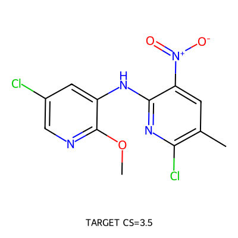

## 合成路线总览

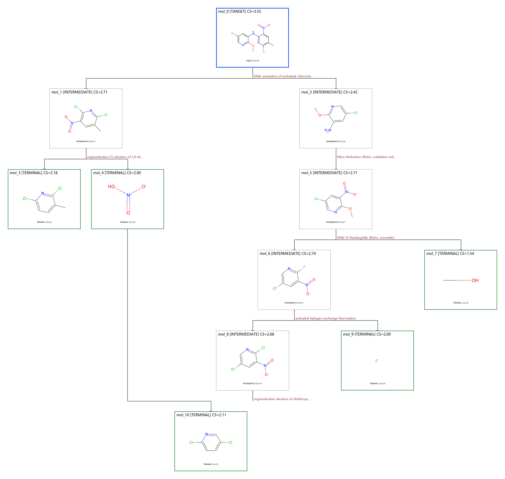

## 起始原料 (5 种)

| 编号 | SMILES | CS Score | 分类 | 图像 |
|------|--------|----------|------|------|
| 1 | `Cc1ccc(Cl)nc1Cl` | 2.18 | trivial | 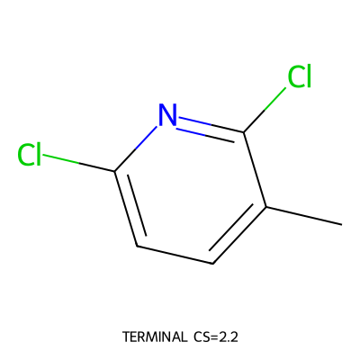 |
| 2 | `O=[N+]([O-])O` | 2.00 | trivial | 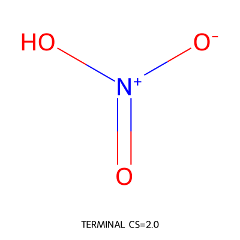 |
| 3 | `CO` | 1.54 | trivial | 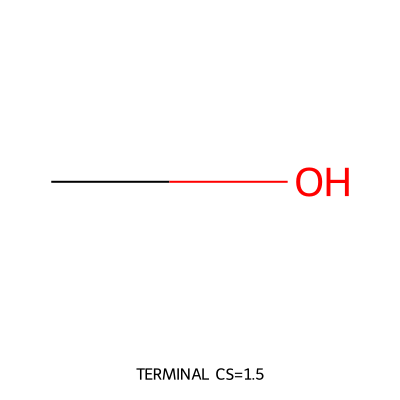 |
| 4 | `[F-]` | 2.00 | trivial | 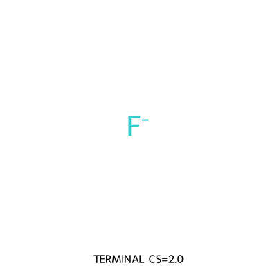 |
| 5 | `Clc1ccc(Cl)nc1` | 2.11 | trivial | 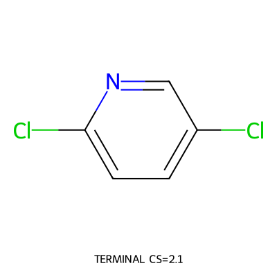 |

## 正向合成步骤 (6 步)

### Step 1: regioselective C5 nitration of 2,6-dichloro-3-methylpyridine

**反应**: `Cc1ccc(Cl)nc1Cl.O=[N+]([O-])O>>Cc1cc([N+](=O)[O-])c(Cl)nc1Cl`

**前体**:

- `Cc1ccc(Cl)nc1Cl` [terminal]
  

- `O=[N+]([O-])O` [terminal]
  

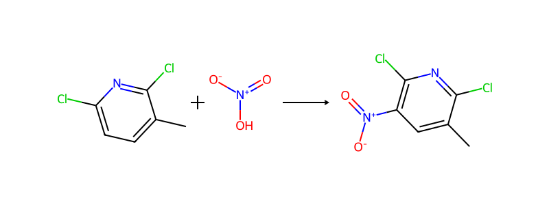

**产物**: `Cc1cc([N+](=O)[O-])c(Cl)nc1Cl`

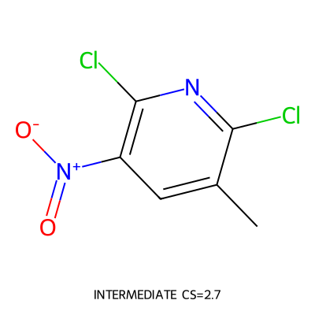

- **选择理由**: Commit corrected direct nitration for the right electrophile. The changed site is C5-H of Cc1ccc(Cl)nc1Cl, converted to C-NO2 using O=[N+]([O-])O as explicit nitro atom source. The dichloropyridine carbon skeleton, methyl group, and both chloride substituents are preserved, giving Cc1cc([N+](=O)[O-])c(Cl)nc1Cl. This avoids mol_3 because mol_3 only serves as a Sandmeyer precursor back to an aryl chloride; the simpler precursor is the dichloromethylpyridine itself. Residual risk is harsh/regioselective heteroaryl nitration, but sandbox no longer has the previous skeleton atom-source hard block.
- **置信度**: medium
- **被拒绝**:
  - fgi:0: Built-in nitration hard-blocked on skeleton_imbalance.
  - custom:llm_custom:0: First custom nitration omitted nitro atom source and was hard-blocked.
  - fgi:1: Sandmeyer via mol_3 is a less simple amino detour.
- **Decision Audit**:
  - selected action: custom:llm_custom:1
  - decision source: route_sketch_derived_custom
  - route plan: plan:ad36b3b7 r0: Keep the convergent late SNAr target disconnection, but do not stop at mol_3 or mol_5 if a chemically credible, simpler halopyridine precursor can be registered and validated. Replace the mol_3 Sandmeyer detour with direct C5 nitration of the right dichloromet [revises]
  - route sketch: sketch:mol_1:1: Install the nitro group on 2,6-dichloro-3-methylpyridine using nitric acid/nitronium source while preserving the dichloromethylpyridine skeleton. -> propose_action
  - validation gate: missing_evidence (missing_evidence=template_not_attempted)
  - applied experience cards: exp_route_sketch_for_weak_action_space, exp_custom_precursor_after_rejection, exp_template_pass_not_enough
  - prompt events: stage.commit, decision.commit_requested, action.custom_precursors, strategy.route_sketch_used_for_custom_action, sandbox.success, validation.pass, validation.missing_evidence, validation.template_not_attempted
  - custom provenance:
    - why existing actions rejected: Built-in nitration hard-blocked; the previous custom action omitted nitric acid/nitronium as the nitro atom source; Sandmeyer via mol_3 is less simple.
    - rationale: A nitronium/nitric-acid source installs the C5 nitro group on a preformed 2,6-dichloro-3-methylpyridine core. The carbon skeleton, methyl substituent and both chlorides are preserved; only C-H is converted to C-NO2.
  - sandbox evidence:
    - [0] `custom:llm_custom:1` pass, forward=True, gate=missing_evidence, missing_evidence=template_not_attempted, reaction=regioselective C5 nitration of 2,6-dichloro-3-methylpyridine
  - rejected alternatives:
    - fgi:0: Built-in nitration hard-blocked on skeleton_imbalance.
    - custom:llm_custom:0: First custom nitration omitted nitro atom source and was hard-blocked.
    - fgi:1: Sandmeyer via mol_3 is a less simple amino detour.

### Step 2: regioselective nitration of dichloropyridine

**反应**: `Clc1ccc(Cl)nc1.O=[N+]([O-])O>>O=[N+]([O-])c1cc(Cl)cnc1Cl`

**前体**:

- `Clc1ccc(Cl)nc1` [terminal]
  

- `O=[N+]([O-])O` [terminal]
  

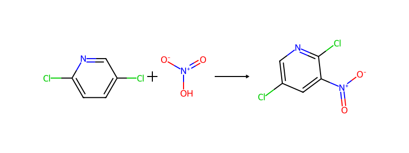

**产物**: `O=[N+]([O-])c1cc(Cl)cnc1Cl`

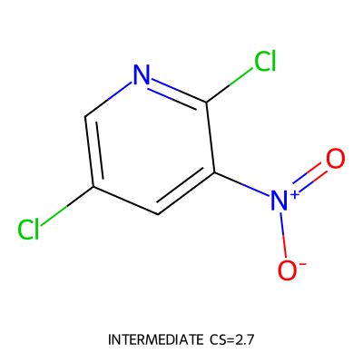

- **选择理由**: Commit nitration of dichloropyridine to prepare O=[N+]([O-])c1cc(Cl)cnc1Cl. The changed site is aryl C-H to C-NO2; Clc1ccc(Cl)cn1 preserves the pyridine skeleton and both chloro substituents, and O=[N+]([O-])O provides the nitro atom source. This extends mol_5 beyond the aryl fluoride by a Halex precursor and then to a simpler dichloropyridine terminal. The main risk is regioselective nitration of an electron-poor halopyridine under harsh conditions, but atom accounting is explicit and there is no skeleton hard block in the custom sandbox.
- **置信度**: medium
- **被拒绝**:
  - fgi:0: Built-in nitration lacks explicit nitro atom source and/or hard-blocked in analogous checks.
  - fgi:1: Sandmeyer-like paths do not simplify the halopyridine core.
- **Decision Audit**:
  - selected action: custom:llm_custom:0
  - decision source: route_sketch_derived_custom
  - route plan: plan:ad36b3b7 r0: Keep the convergent late SNAr target disconnection, but do not stop at mol_3 or mol_5 if a chemically credible, simpler halopyridine precursor can be registered and validated. Replace the mol_3 Sandmeyer detour with direct C5 nitration of the right dichloromet [revises]
  - route sketch: sketch:mol_8:0: Use regioselective nitration of dichloropyridine to install the nitro group on the same preformed halopyridine core. This gives a simpler halopyridine terminal plus nitric acid/nitronium source. -> propose_action
  - validation gate: missing_evidence (missing_evidence=template_not_attempted)
  - applied experience cards: exp_route_sketch_for_weak_action_space, exp_custom_precursor_after_rejection, exp_template_pass_not_enough
  - prompt events: stage.commit, decision.commit_requested, action.custom_precursors, strategy.route_sketch_used_for_custom_action, sandbox.success, validation.pass, validation.missing_evidence, validation.template_not_attempted
  - custom provenance:
    - why existing actions rejected: Built-in nitration did not provide a complete atom source for the nitro group; Sandmeyer-type alternatives would add amino complexity rather than simplify the halopyridine core.
    - rationale: A nitronium/nitric-acid source installs the nitro group on the dichloropyridine core. Both aryl chlorides and the pyridine skeleton are preserved.
  - sandbox evidence:
    - [0] `custom:llm_custom:0` pass, forward=True, gate=missing_evidence, missing_evidence=template_not_attempted, reaction=regioselective nitration of dichloropyridine
  - rejected alternatives:
    - fgi:0: Built-in nitration lacks explicit nitro atom source and/or hard-blocked in analogous checks.
    - fgi:1: Sandmeyer-like paths do not simplify the halopyridine core.

### Step 3: activated halogen exchange fluorination

**反应**: `O=[N+]([O-])c1cc(Cl)cnc1Cl.[F-]>>O=[N+]([O-])c1cc(Cl)cnc1F`

**前体**:

- `O=[N+]([O-])c1cc(Cl)cnc1Cl` [intermediate]
  

- `[F-]` [terminal]
  

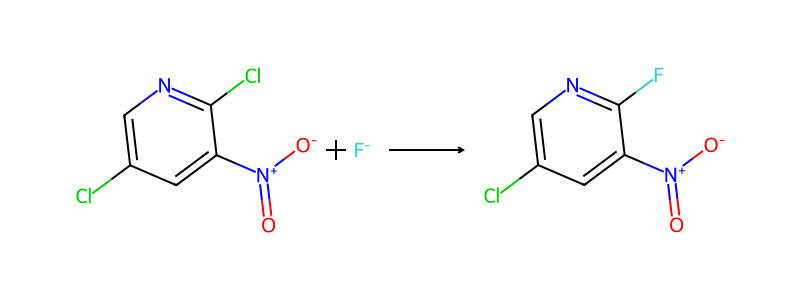

**产物**: `O=[N+]([O-])c1cc(Cl)cnc1F`

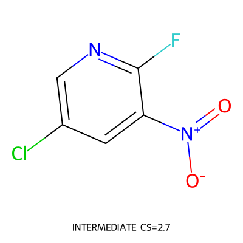

- **选择理由**: Commit Halex/SNAr fluorination for mol_5. The changed site is the activated aryl halide that becomes C-F; O=[N+]([O-])c1cc(Cl)cnc1Cl supplies the same nitrochloropyridine skeleton, and [F-] supplies the fluorine atom. The nitro group and pyridine N activate this site, while the other aryl chloride is preserved. This is a more actionable continuation than accepting mol_5: it reaches a simpler/common dichloro-nitropyridine precursor and avoids the hard-blocked direct nitration and non-simplifying Sandmeyer candidates.
- **置信度**: medium
- **被拒绝**:
  - fgi:0: Built-in direct nitration candidate hard-blocks or lacks reliable atom/site accounting.
  - fgi:1: Sandmeyer retreats to an amino nitro fluoro precursor rather than simplifying the aryl fluoride handle.
- **Decision Audit**:
  - selected action: custom:llm_custom:0
  - decision source: route_sketch_derived_custom
  - route plan: plan:ad36b3b7 r0: Keep the convergent late SNAr target disconnection, but do not stop at mol_3 or mol_5 if a chemically credible, simpler halopyridine precursor can be registered and validated. Replace the mol_3 Sandmeyer detour with direct C5 nitration of the right dichloromet [revises]
  - route sketch: sketch:mol_6:0: Disconnect the aryl C-F bond as Halex/SNAr fluorination of O=[N+]([O-])c1cc(Cl)cnc1Cl. The nitro group and pyridine N activate the chloro position toward fluoride substitution, while the other chloride is preserved. -> propose_action
  - validation gate: missing_evidence (missing_evidence=template_not_attempted)
  - applied experience cards: exp_route_sketch_for_weak_action_space, exp_custom_precursor_after_rejection, exp_advanced_terminal_short_route_rescue
  - prompt events: stage.commit, decision.commit_requested, action.custom_precursors, strategy.route_sketch_used_for_custom_action, sandbox.success, validation.pass, validation.missing_evidence, validation.template_not_attempted
  - custom provenance:
    - why existing actions rejected: Nitration hard-blocks or requires harsher regioselective EAS; Sandmeyer gives an aminonitrofluoro precursor. Neither captures the simpler dichloro-nitro pyridine plus fluoride route.
    - rationale: Fluoride substitutes the activated chloro leaving group on the nitro/pyridine-activated ring to give the aryl fluoride. The pyridine core, nitro group and the nonreacting aryl chloride are preserved.
  - sandbox evidence:
    - [0] `custom:llm_custom:0` pass, forward=True, gate=missing_evidence, missing_evidence=template_not_attempted, reaction=activated halogen exchange fluorination
  - rejected alternatives:
    - fgi:0: Built-in direct nitration candidate hard-blocks or lacks reliable atom/site accounting.
    - fgi:1: Sandmeyer retreats to an amino nitro fluoro precursor rather than simplifying the aryl fluoride handle.

### Step 4: SNAr O-Nucleophile (Retro, aromatic)

**反应**: `O=[N+]([O-])c1cc(Cl)cnc1F.CO>>COc1ncc(Cl)cc1[N+](=O)[O-]`

**前体**:

- `O=[N+]([O-])c1cc(Cl)cnc1F` [intermediate]
  

- `CO` [terminal]
  

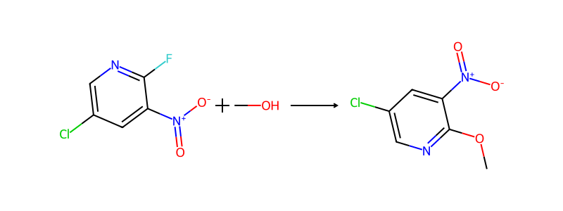

**产物**: `COc1ncc(Cl)cc1[N+](=O)[O-]`

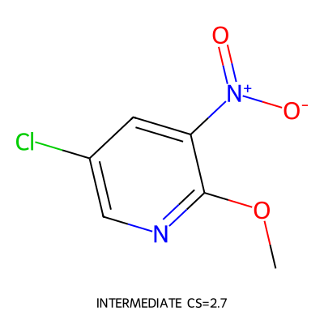

- **选择理由**: Commit methoxy SNAr to prepare COc1ncc(Cl)cc1[N+](=O)[O-] from O=[N+]([O-])c1cc(Cl)cnc1F and methanol. The changed site is aryl C-F to C-OMe; the nitro group, chloride and pyridine core are preserved. Nitro and pyridine N activate the aryl fluoride toward O-nucleophile substitution, and this is more direct than Ullmann/Chan-Lam O-arylation or the hard-blocked direct nitration candidate.
- **置信度**: medium
- **被拒绝**:
  - site:bond:1:alt:0: Requires aryl bromide and metal-mediated O-arylation.
  - site:bond:1:alt:1: Requires heteroaryl boronic acid.
  - fgi:0: Built-in direct nitration hard-blocked in the previous evaluation.
- **Decision Audit**:
  - selected action: site:bond:1:alt:2
  - decision source: llm_selected
  - route plan: plan:ad36b3b7 r0: Keep the convergent late SNAr target disconnection, but do not stop at mol_3 or mol_5 if a chemically credible, simpler halopyridine precursor can be registered and validated. Replace the mol_3 Sandmeyer detour with direct C5 nitration of the right dichloromet [supports]
  - validation gate: missing_evidence (missing_evidence=template_target_not_generated)
  - applied experience cards: exp_template_pass_not_enough, exp_route_plan_revision, exp_global_route_plan_persistence
  - prompt events: stage.commit, decision.commit_requested, action.system_template, sandbox.success, validation.pass, validation.missing_evidence, validation.template_target_not_generated, strategy.route_plan_active
  - sandbox evidence:
    - [0] `site:bond:1:alt:2` pass, forward=True, gate=missing_evidence, missing_evidence=template_target_not_generated, reaction=SNAr O-Nucleophile
  - rejected alternatives:
    - site:bond:1:alt:0: Requires aryl bromide and metal-mediated O-arylation.
    - site:bond:1:alt:1: Requires heteroaryl boronic acid.
    - fgi:0: Built-in direct nitration hard-blocked in the previous evaluation.

### Step 5: Nitro Reduction (Retro, oxidation reduction)

**反应**: `COc1ncc(Cl)cc1[N+](=O)[O-]>>COc1ncc(Cl)cc1N`

**前体**:

- `COc1ncc(Cl)cc1[N+](=O)[O-]` [intermediate]
  

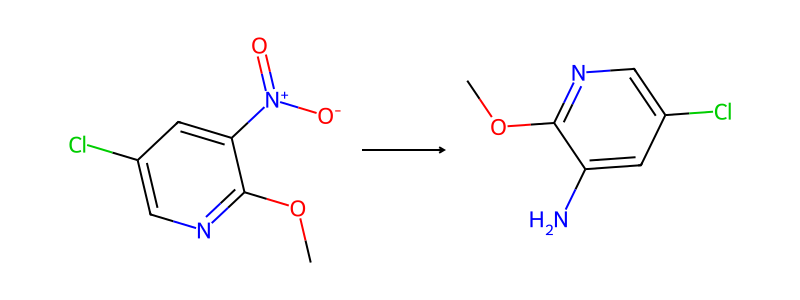

**产物**: `COc1ncc(Cl)cc1N`

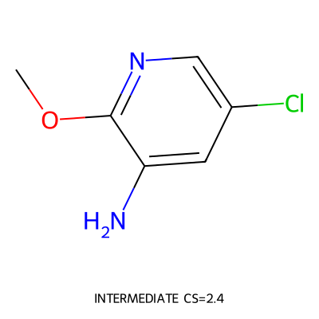

- **选择理由**: Commit nitro reduction to prepare COc1ncc(Cl)cc1N from COc1ncc(Cl)cc1[N+](=O)[O-]. The changed site is aryl NO2 to aryl NH2; the methoxy ether, aryl chloride and pyridine core are preserved. This is cleaner than changing the methoxy bond at the amine stage because it avoids coupling/etherification in the presence of a free aminopyridine.
- **置信度**: medium
- **被拒绝**:
  - site:bond:1:alt:0: Ullmann O-arylation at this stage needs metal conditions with free amine.
  - site:bond:1:alt:2: Methoxy SNAr is better done one node earlier on the nitro-activated precursor.
- **Decision Audit**:
  - selected action: fgi:0
  - decision source: llm_selected
  - route plan: plan:ad36b3b7 r0: Keep the convergent late SNAr target disconnection, but do not stop at mol_3 or mol_5 if a chemically credible, simpler halopyridine precursor can be registered and validated. Replace the mol_3 Sandmeyer detour with direct C5 nitration of the right dichloromet [supports]
  - validation gate: missing_evidence (missing_evidence=template_target_not_generated)
  - applied experience cards: exp_template_pass_not_enough, exp_route_plan_revision, exp_global_route_plan_persistence
  - prompt events: stage.commit, decision.commit_requested, action.system_template, sandbox.success, validation.pass, validation.missing_evidence, validation.template_target_not_generated, strategy.route_plan_active
  - sandbox evidence:
    - [0] `fgi:0` pass, forward=True, gate=missing_evidence, missing_evidence=template_target_not_generated, reaction=fgi
  - rejected alternatives:
    - site:bond:1:alt:0: Ullmann O-arylation at this stage needs metal conditions with free amine.
    - site:bond:1:alt:2: Methoxy SNAr is better done one node earlier on the nitro-activated precursor.

### Step 6: SNAr amination of activated chloronitropyridine

**反应**: `Cc1cc([N+](=O)[O-])c(Cl)nc1Cl.COc1ncc(Cl)cc1N>>COc1ncc(Cl)cc1Nc1nc(Cl)c(C)cc1[N+](=O)[O-]`

**前体**:

- `Cc1cc([N+](=O)[O-])c(Cl)nc1Cl` [intermediate]
  

- `COc1ncc(Cl)cc1N` [intermediate]
  

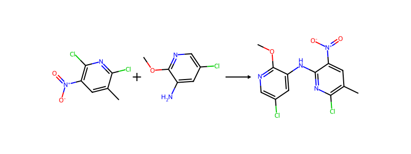

**产物**: `COc1ncc(Cl)cc1Nc1nc(Cl)c(C)cc1[N+](=O)[O-]`

- **选择理由**: Explicit late SNAr forms the target C-N bond from Cc1cc([N+](=O)[O-])c(Cl)nc1Cl and COc1ncc(Cl)cc1N. The changed site is the activated C-Cl on the right nitro/chloropyridine; the left methoxy-chloropyridine, nitro group, methyl group and nonreacting chloride are preserved. This retains the successful convergent disconnection while allowing deeper continuation of the terminal branches.
- **置信度**: medium
- **被拒绝**:
  - site:bond:9:alt:0: Wildcard electrophile.
  - site:bond:9:alt:1: Less direct bromo Ullmann route.
- **Decision Audit**:
  - selected action: custom:llm_custom:0
  - decision source: route_sketch_derived_custom
  - route plan: plan:ad36b3b7 r0: Keep the convergent late SNAr target disconnection, but do not stop at mol_3 or mol_5 if a chemically credible, simpler halopyridine precursor can be registered and validated. Replace the mol_3 Sandmeyer detour with direct C5 nitration of the right dichloromet [supports]
  - route sketch: sketch:mol_0:0: Late SNAr of the aminomethoxy-chloropyridine onto the nitro-activated dichloromethylpyridine electrophile forms the target diarylamine. -> propose_action
  - validation gate: missing_evidence (missing_evidence=template_not_attempted)
  - applied experience cards: exp_route_sketch_for_weak_action_space, exp_custom_precursor_after_rejection, exp_template_pass_not_enough
  - prompt events: stage.commit, decision.commit_requested, action.custom_precursors, strategy.route_sketch_used_for_custom_action, sandbox.success, validation.pass, validation.missing_evidence, validation.template_not_attempted
  - custom provenance:
    - why existing actions rejected: Listed SNAr has a wildcard electrophile; cross-coupling alternatives introduce bromo handles unnecessarily.
    - rationale: The aminomethoxy-chloropyridine nitrogen replaces the activated chloride on the nitro/chloropyridine electrophile, preserving both heteroaryl skeletons and nonparticipating substituents.
  - sandbox evidence:
    - [0] `custom:llm_custom:0` pass, forward=True, gate=missing_evidence, missing_evidence=template_not_attempted, reaction=SNAr amination of activated chloronitropyridine
  - rejected alternatives:
    - site:bond:9:alt:0: Wildcard electrophile.
    - site:bond:9:alt:1: Less direct bromo Ullmann route.

## 分子一览

| ID | SMILES | 角色 | CS Score | 图像 |
|-----|--------|------|----------|------|
| mol_0 | `COc1ncc(Cl)cc1Nc1nc(Cl)c(C)...` | target | 3.55 | [查看](images/mol_0.png) |
| mol_1 | `Cc1cc([N+](=O)[O-])c(Cl)nc1Cl` | intermediate | 2.71 | [查看](images/mol_1.png) |
| mol_2 | `COc1ncc(Cl)cc1N` | intermediate | 2.42 | [查看](images/mol_2.png) |
| mol_3 | `Cc1ccc(Cl)nc1Cl` | terminal | 2.18 | [查看](images/mol_3.png) |
| mol_4 | `O=[N+]([O-])O` | terminal | 2.00 | [查看](images/mol_4.png) |
| mol_5 | `COc1ncc(Cl)cc1[N+](=O)[O-]` | intermediate | 2.71 | [查看](images/mol_5.png) |
| mol_6 | `O=[N+]([O-])c1cc(Cl)cnc1F` | intermediate | 2.74 | [查看](images/mol_6.png) |
| mol_7 | `CO` | terminal | 1.54 | [查看](images/mol_7.png) |
| mol_8 | `O=[N+]([O-])c1cc(Cl)cnc1Cl` | intermediate | 2.68 | [查看](images/mol_8.png) |
| mol_9 | `[F-]` | terminal | 2.00 | [查看](images/mol_9.png) |
| mol_10 | `Clc1ccc(Cl)nc1` | terminal | 2.11 | [查看](images/mol_10.png) |
